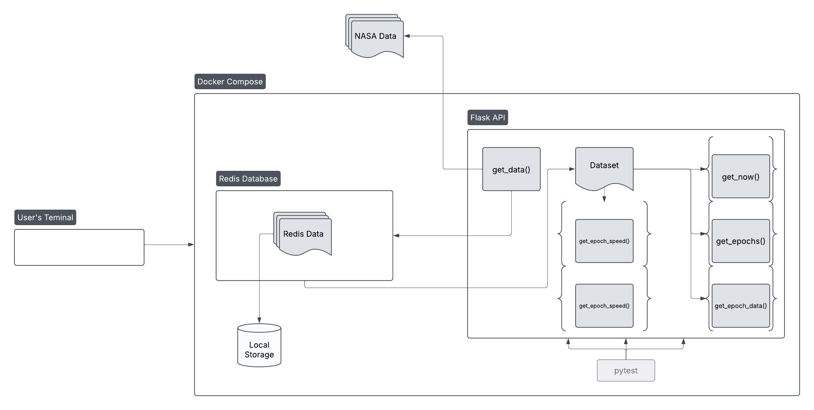

# Introduction to Flask

In this homework we explored the use of web applications in conjunction with databases to make more interactive and more robust applications. To do this we converted the python script from [homework05](https://github.com/NatBea03/COE-332-HW/tree/main/homework05) and uploaded the data to a redis database, running in a separate container. Similar to before, It will access the data from [this NASA website](https://spotthestation.nasa.gov/trajectory_data.cfm) which gets updated several times a week to ensure that the space station always has accurate trajectory data, but this time it will upload the data into a redis database, which will then back itself up onto the local computer's filesystem. This ensures that the data will stay up to date, but it wont need to request the data from NASA every time it is launched:



Here we can see that the within one container there is a flask app running where all of the functions reside, and in the other is the redis database, where all the data lives. Both of which were created with the docker compose utility. When the app is initially called it gathers the data from NASA and is then uploaded to the database with an associated key, and is periodically saved to the local storage of the user. Whenever a rout is called, instead of getting the data from NASA's website, it instead pulls the data from the redis database. The user is then interacting with the flask app within the docker image.

## Building the Image

In order to use Docker, it must be installed to your computer, similar to how Git must be installed to use git commands. The most recent version can be downloaded [here](https://www.docker.com/get-started/). In the control panel, navigate to where you cloned the github repo, and create an empty file called "data" with the mkdir command as follows:

`mkdir data`

Now the services can be built by typing:

`docker compose build`

This will then create the image locally, allowing you to run it any time.

## Running the App

Since the foundation of this homework is now multiple services running at the same time, the way that you run the image will be a little different. This time to run it you would type:

`docker compose up -d`

where -d runs the image in the background so you can use the same terminal for inputs. With this done you can now call the flask app by typing

`curl localhost:5000/now`

where the number 5000 refers to the same number port that the flask app is running on. If working properly it should provide the data for the time closest to the current time, like this:

```text
{
  "EPOCH": "2025-073T00:20:00.000Z",
  "Instantaneous Velocity": {
    "#text": "7.6616243318175465",
    "@units": "km/s"
  },
  "Latitude": {
    "#text": "-19.459837535050806",
    "@units": "degrees"
  },
  "Longitude": {
    "#text": "-134.61328095983592",
    "@units": "degrees"
  },
  "Nearest Location": {
    "#text": "Not near any cities, likely over an ocean",
    "@units": "N/A"
  },
  "X": {
    "#text": "4763.0810196544899",
    "@units": "km"
  },
  "X_DOT": {
    "#text": "-1.93759841322356",
    "@units": "km/s"
  },
  "Y": {
    "#text": "4285.1444503352604",
    "@units": "km"
  },
  "Y_DOT": {
    "#text": "5.0211205229752096",
    "@units": "km/s"
  },
  "Z": {
    "#text": "-2262.8692057865501",
    "@units": "km"
  },
  "Z_DOT": {
    "#text": "5.4529394352706104",
    "@units": "km/s"
  }
}
```

If instead you get an output like:

`curl: (56) Recv failure: Connection reset by peer`

then that means that the flask service is still booting up. Wait a few seconds and try again.

Here is a list of some other commands and their outputs include

|Route|Output|
|-----|------|
|`/epochs`|Returns the entire dataset|
|`/epochs?limit=int&offset=int`[^1]|Returns the epoch data skipping however many specified in offset and goes until the limit is reached (defaults to a limit of None and an offset of 0 if an invalid input is requested for either entry)|
|`/epochs/<epoch>`|Returns epoch specified by the timestamp provided|
|`/epochs/<epoch>/speed`|Returns the speed of the ISS at the timestamp provided|
|`/epochs/<epoch>/location`|Returns the location of the ISS at the timestamp provided|

Finally, when done with the app you can type:

`docker compose down`

to stop and remove all containers that were started.

### Pytest

The pytest script works for both the routes and the functions. In order to run the pytest cases. first start up the containers with:

`docker compose up -d`

then in the terminal type:

`pytest`

If everything is working an output should appear, similar to this:

```text
====================================================== test session starts ====================================================
platform linux -- Python 3.12.3, pytest-8.3.4, pluggy-1.5.0
rootdir: /home/ubuntu/COE-332-HW/homework06
collected 12 items                                                                                                                                                                                                                                                                                

test_iss_tracker.py ............                                                                                          [100%]
====================================================== 12 passed in 4.60s ====================================================
```

[^1]: When calling this route everything after curl must be in quotes. Example: curl 'localhost:5000/epochs?limit=12&offset=32'
